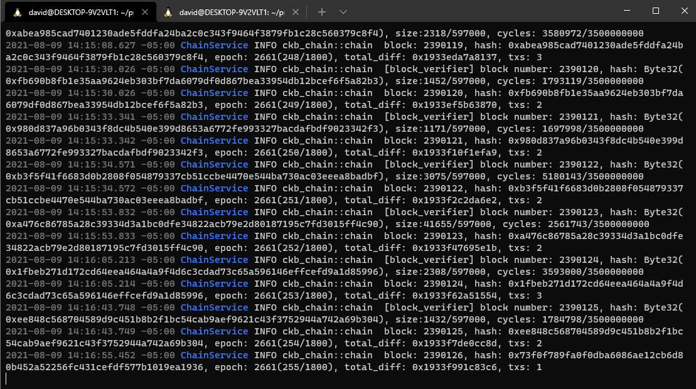
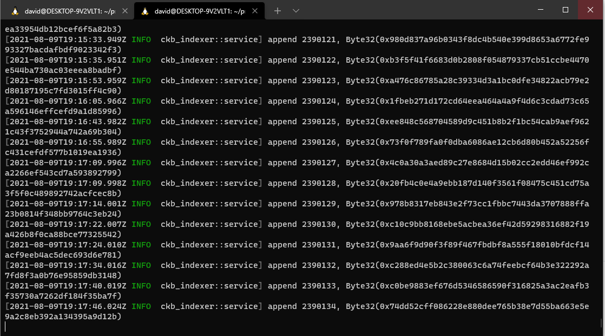

<h1>Nervos Task 0 </h1>

<h2>A screenshot of the console output from your local Testnet CKB Node after it has fully synchronized with the network.</h2>

    

<h2>A screenshot of the console output from your local CKB Indexer after it has fully synchronized with the local Testnet CKB Node.</h2>

    

