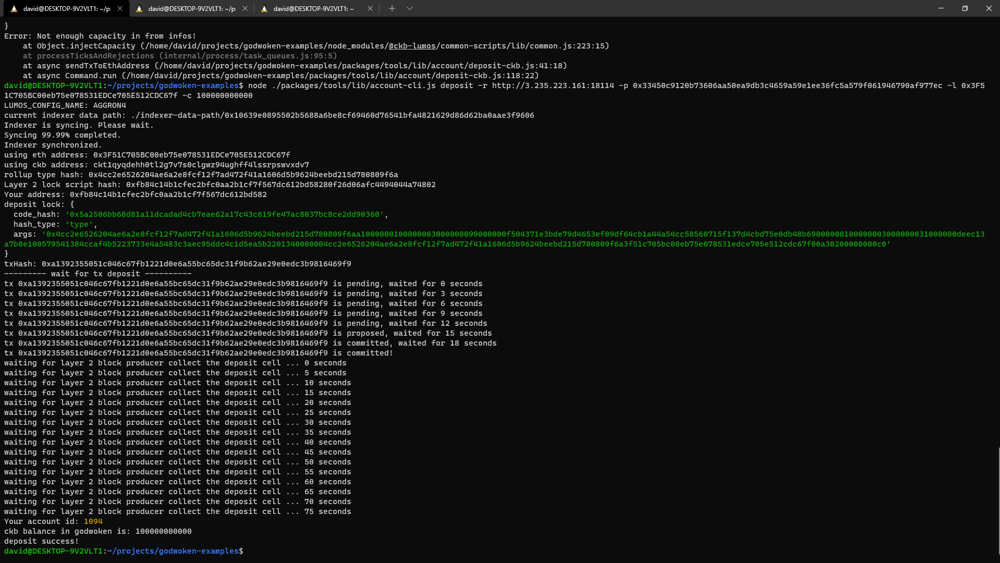

<h1>Nervos Task 1 </h1>

<h2>A screenshot of the accounts you created (account list) in ckb-cli.</h2>

    

<h2>A link to the Layer 1 address you funded on the Testnet Explorer.</h2>
<a href="https://explorer.nervos.org/aggron/address/ckt1qyqdehh0tl2g7v7s0clgwz94ughff4lssrpswvxdv7">Layer 1 testnet address</a>

<h2>A screenshot of the console output immediately after you have successfully submitted a deposit to Layer 2.</h2>

    

