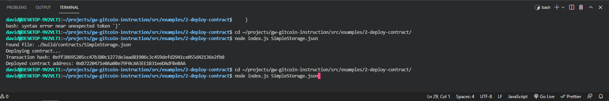

<h1>Nervos Task 2 </h1>

<h2>A screenshot of the console output immediately after you have successfully deployed a smart contract.</h2>

    

<h2>The transaction hash from the contract deployment (in text format).</h2>
<h3>0xff38695205cc47b380c1277de3aad81906c3c459defd2941ce055d42136e2fb8</h3>

<h2>The deployed contract address from the contract deployment (in text format).</h2>
<h3>0xB7220471e0Aa0Be79F0cAA3EE1B31eeDAdFBeBAA</h3>
