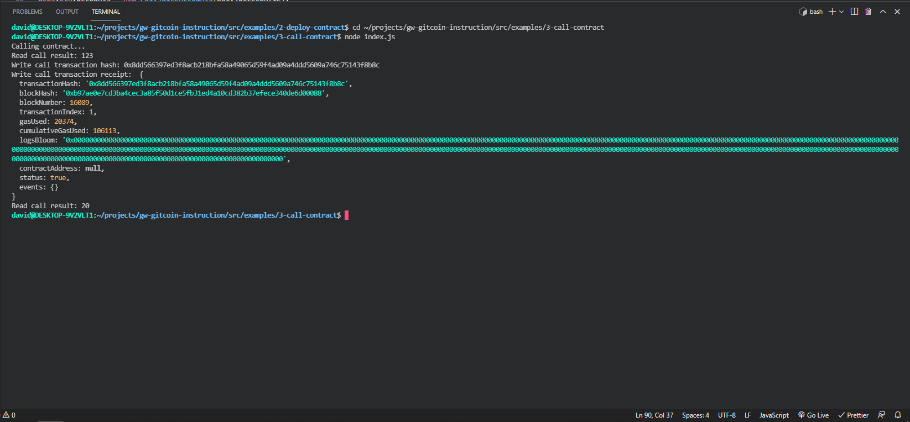

<h1>Nervos Task 2 </h1>
<hr>
<h2>A screenshot of the console output immediately after you have successfully issued a smart contract call.</h2>
<p align="center">
    
</p>
<hr>
<h2>The transaction hash from the console output (in text format).</h2>
<h3>0x8dd566397ed3f8acb218bfa58a49065d59f4ad09a4ddd5609a746c75143f8b8c</h3>
<hr>
<h2>The contract address that you called (in text format).</h2>
<h3>0xB7220471e0Aa0Be79F0cAA3EE1B31eeDAdFBeBAA</h3>
<hr>
<h2>The ABI for contract you made a call on (in text format).</h2>

```
ABI:[
  {
    inputs: [],
    stateMutability: "payable",
    type: "constructor",
  },
  {
    inputs: [
      {
        internalType: "uint256",
        name: "x",
        type: "uint256",
      },
    ],
    name: "set",
    outputs: [],
    stateMutability: "payable",
    type: "function",
  },
  {
    inputs: [],
    name: "get",
    outputs: [
      {
        internalType: "uint256",
        name: "",
        type: "uint256",
      },
    ],
    stateMutability: "view",
    type: "function",
  },
]
```
