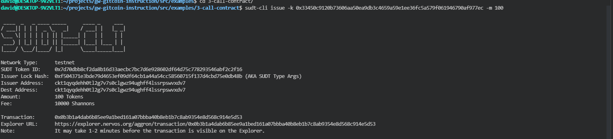
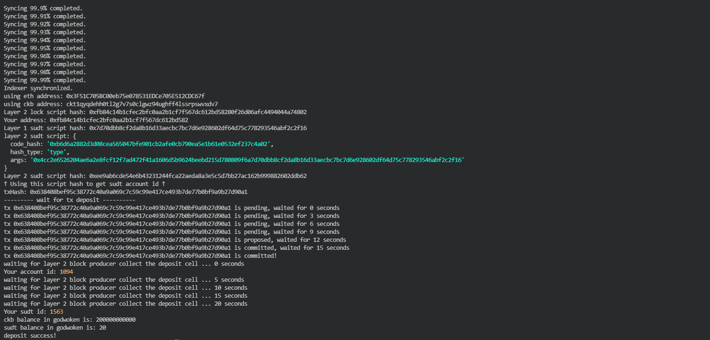

<h1>Nervos Task 4 </h1>

<h2>A link to the Layer 1 address you funded on the Testnet Explorer</h2>
<a href="https://explorer.nervos.org/aggron/address/ckt1qyqdehh0tl2g7v7s0clgwz94ughff4lssrpswvxdv7">Layer 1 testnet address</a>

<h2>A screenshot of the console output immediately after using sudt-cli to create your SUDT tokens on Layer 1.</h2>

    

<h2>A link to the transaction ID created by sudt-cli on the Testnet Explorer.
</h2>
<a href="https://explorer.nervos.org/aggron/transaction/0x0b3b1a4dab6b85ee9a1bed161a07bbba40b8eb1b7c8ab9354e8d568c914e5d53">Transaction ID created by sudt-cli on the Testnet Explorer.
</a>

<h2>A screenshot of the console output immediately after you have successfully submitted a deposit to Layer 2 using the account-cli tool.</h2>

    

<h2>The SUDT ID from the console output after executing the deposit script (in text format).</h2>
<h3>1563</h3>
