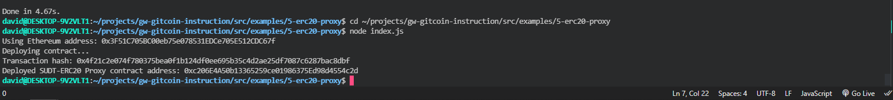
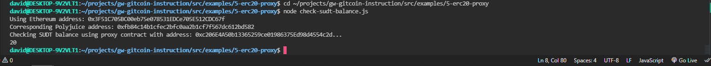

<h1>Nervos Task 5 </h1>

<h2>A screenshot of the console output immediately after deploying smart contract.</h2>

    

<h2>The address of the ERC20 Proxy Contract you deployed (in text format).
</h2>
<h3>0xc206E4A50b13365259ce01986375Ed98d4554c2d</h3>

<h2>A screenshot of the console output immediately after checking your SUDT balance.</h2>

    

<h2>The Ethereum address that was checked (in text format).</h2>
<h3>0x3F51C705BC00eb75e078531EDCe705E512CDC67f</h3>
